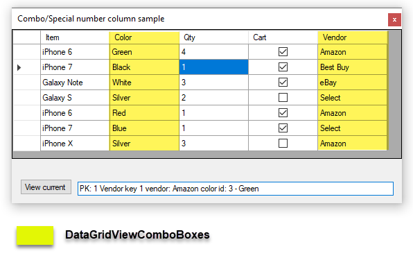

# About

> Originally just for DataGridViewComboBox has now expanded

Simple code sample for DataGridViewComboBox and DataGridViewCheckBox feed from SQL-Server using DataTable containers

- To see how to get at the current row values see [Form1.CurrentValuesView](https://github.com/karenpayneoregon/datagridview-combobox-cs/blob/master/DataGridViewComboCS/Form1.cs#L107) method.
- See the [following](https://github.com/karenpayneoregon/datagridview-combobox-cs/blob/master/DataGridViewComboCS/Form1.cs#L141) to get checked and unchecked rows 

# Instructions

- Open [databasescript.sql](https://github.com/karenpayneoregon/datagridview-combobox-cs/blob/master/DataGridViewComboCS/databasescript.sql) in SSMS (SQL-Server Management Studio)
- Adjust the path the database will be created
- Run the script
- Build the solution
- Run the project

# Requirements

:heavy_check_mark: SQL-Server 2012 or higher

:heavy_check_mark: Visual Studio 2017 or higher